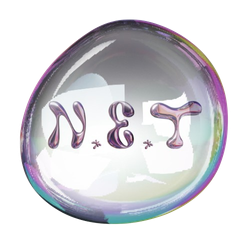

<h1>✨ New Experience & Technology, N.E.T을 소개합니다 ✨</h1>

💜경희대학교 국제캠퍼스 컴퓨터공학부 학술동아리 N.E.T💜
 
N.E.T은 알고리즘, AI 등 다양한 학술주제를 탐구하며 
자유로운 활동을 추구하는 학술 및 친목 동아리입니다.

<h2> 임원진</h2>

||||||
|:---:|:---:|:---:|:---:|:---:|
|회장|부회장|스터디장|홍보부장|교육부장|
|[장영주](https://github.com/youngju6143)|[박현빈](https://github.com/binschocolate)|[김민아](https://github.com/minahkim03)|[김수진](https://github.com/cowboysj)|[이건우](https://github.com/2dubu)|

<h2>More</h2>

